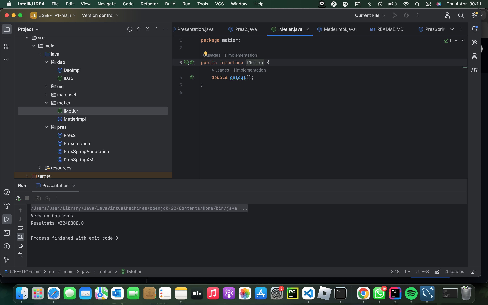
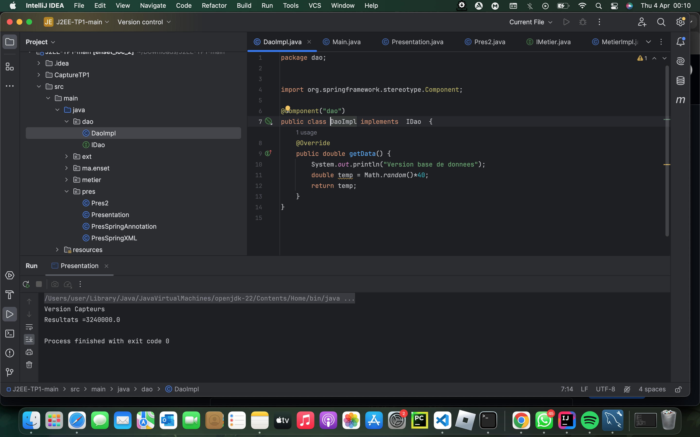
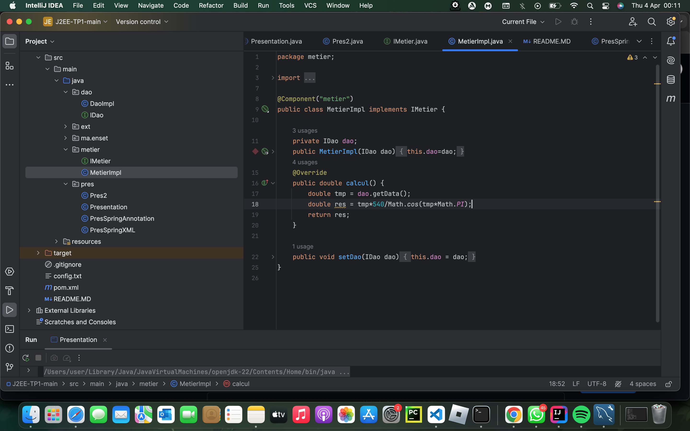
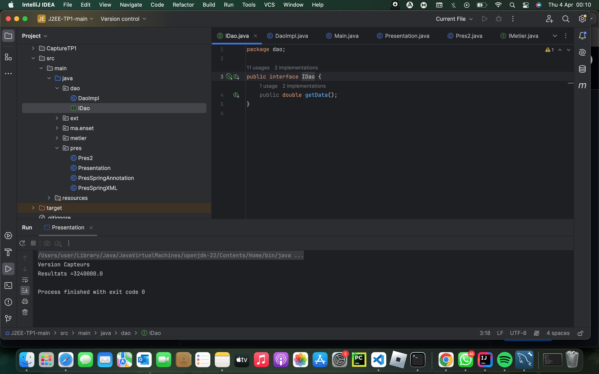
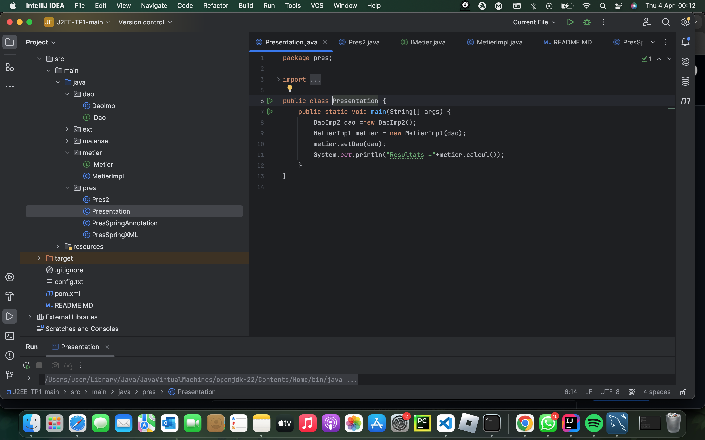
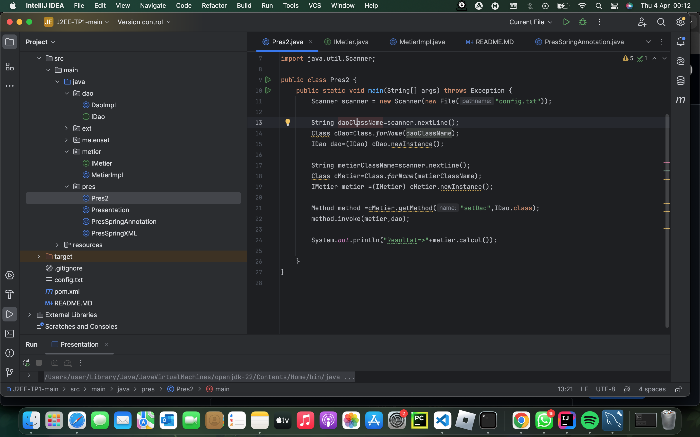
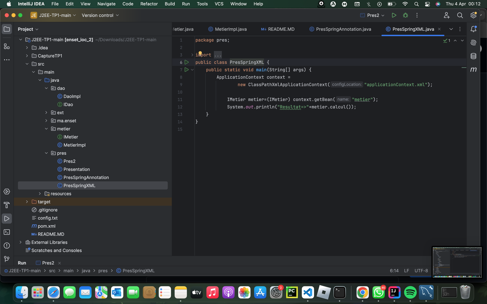
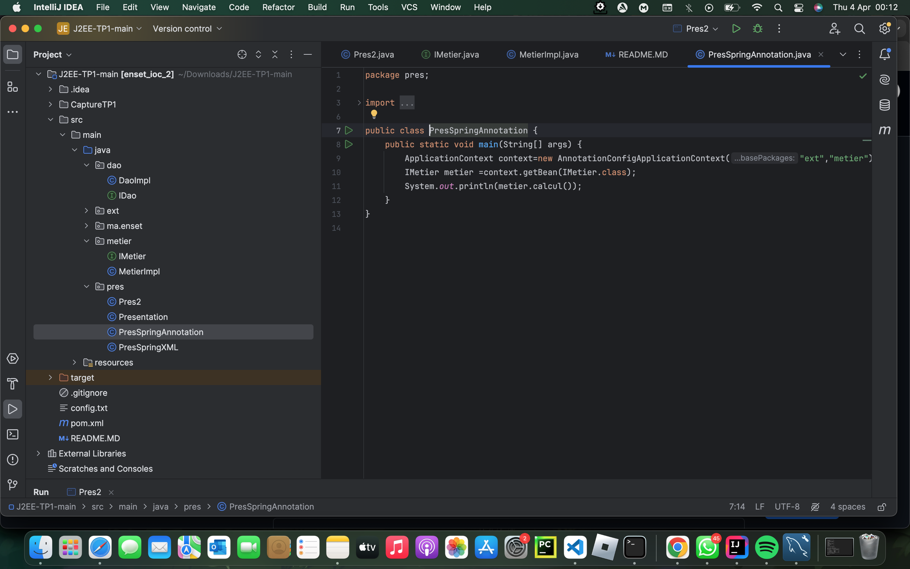

-<h3>Compte rendu<h3>

<h4>1- Créer l'interface IDao avec une méthode getDate</h4>

<h4>2-Implementation de l'interface IDAO</h4>

<h4>3-Interface IMetier</h4>

<h4>4-Implentation IMetier</h4>

<h4>5-Injection des dependances</h4>

<h5>----Statique----</h5>

<h5>----Dynamique----</h5>

<h5>----Spring Framework----</h5>
<h6>Injection de dependances Version XML</h6>

<h6>Injection de dependances Version Annotation</h6>

